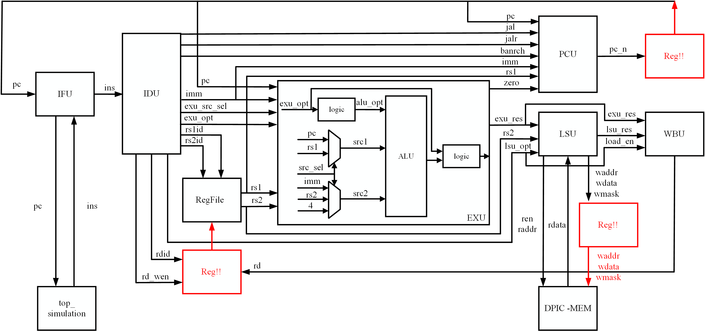
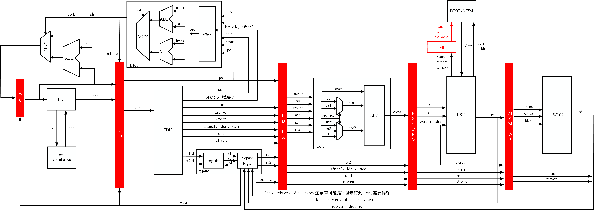
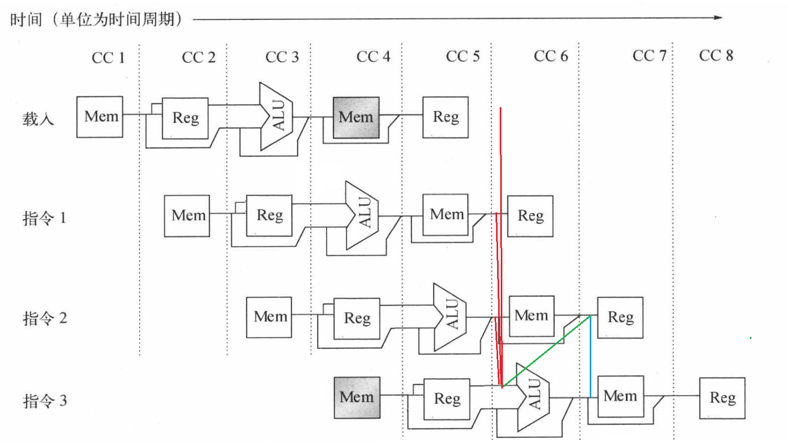
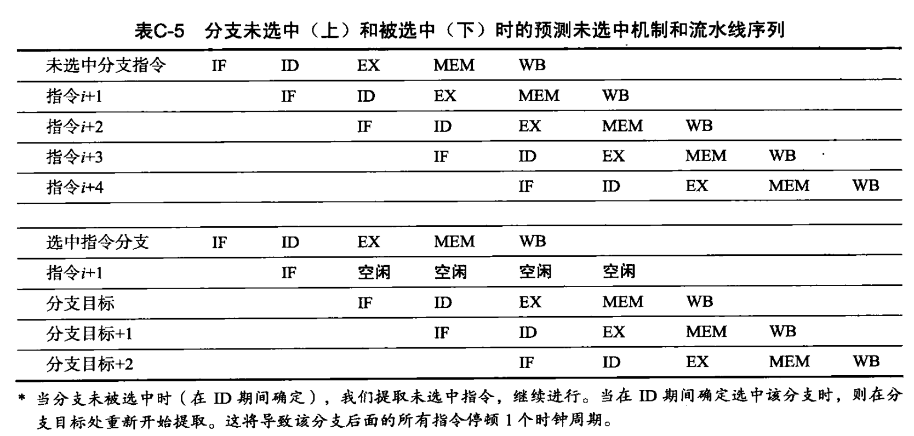
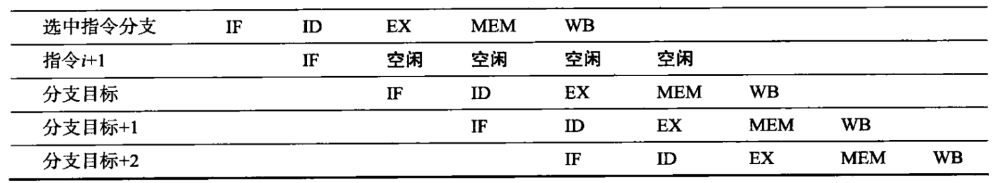
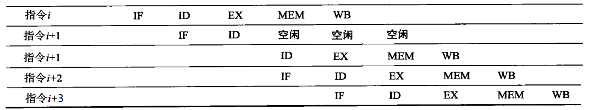

# 一生一芯计划 - riscv64处理器设计

网站链接： [一生一芯计划](https://ysyx.oscc.cc/docs/)

## 开发进度：

1.branch - SingleCycleCPU: RISCV64IM单周期处理器核，已完成设计:


2.branch - FiveStagePipelineCPU: 五级流水线处理器核，已完成设计：


3.总线、外设 正在开发中。

## 代码结构

```c
├── abstract-machine      // high level software.
├── nemu                  // riscv64IM simulation model, use for RTL difftest.
└── npc                   // new processor core, riscv64IM RTL core.
    ├── csrc              // verilator simulation source code.
    │   ├── difftest.cpp
    │   ├── dpic.cpp
    │   ├── include
    │   │   └── include.h
    │   ├── init.cpp
    │   ├── main.cpp
    │   ├── mem.cpp
    │   └── reg.cpp
    ├── Makefile
    └── vsrc              // rtl source code.
        ├── core          // cpu core source code.
        │   ├── bru.sv
        │   ├── bypass.sv
        │   ├── config.sv
        │   ├── exu.sv
        │   ├── idu.sv
        │   ├── ifu.sv
        │   ├── lsu.sv
        │   ├── pipeline
        │   │   ├── pipe_ex_ls.sv
        │   │   ├── pipe_id_ex.sv
        │   │   ├── pipe_if_id.sv
        │   │   └── pipe_ls_wb.sv
        │   ├── regfile.sv
        │   ├── top.sv
        │   └── wbu.sv
        ├── mems          // mem source code.
        ├── soc_top.sv    // soc top code.
        └── stdlib        // standard library for whole soc.
          ├── stl_mux
          │   ├── stl_mux_default.sv
          │   ├── stl_mux_internal.sv
          │   └── stl_mux.sv
          ├── stl_reg.sv
          └── stl_rst.sv
```

## 流水线处理

### 数据冒险旁路

1. 方式1：

   

2. 方式2：

   

Q&A：

1. 我这里采用的是方式1，主要基于三点考虑：

   1. ALU这一级的组合逻辑有乘法，如果再加旁路逻辑，那么cirtical path的时延就太高了。
   2. 如果使用方式2，那么还需要在ex阶段重新访问一次regfile读reg，属实是挺烦的。
   3. 我的BRU在ID阶段进行，如果采用方式1，那ID阶段的reg就是错的了，bru的计算也是错的了。

2. 为什么不采用和计组书上写的一样的前半个收起写reg，后半个周期读reg呢？

   答：因为这样的话就需要用下降沿将一个时钟周期分开，那么ID阶段的slack就不够用了，无法提高到很高的频率！

3. 图中每一条bypass的含义：

   1. 其中红色的为主要bypass路径，即通过后续的三级，来给本级进行bypass。
   2. 绿色为ld指令+alu指令，这种情况即使通过bypass无法解决，需要通过**冒泡**方式来进行处理。
   3. 蓝色为ld+st指令，虽然ld指令的结果在mem后面才可以拿到，但是st保存的reg值也是在mem开始前才需要！这种处理方式是，通过id阶段的bypass逻辑，识别出来以后，通过流水级传递到ex阶段，然后在ex阶段根据这个bypass信号，来决定给mem的输出是什么。

### 控制冒险

使用预测未命中的方案。



### 处理方法

1. 分支冒险：只对IF/ID的reg插入一个nop，对其他的地方不做任何处理。
   

2. ld+alu的数据冒险：对ID/EX的reg插入一个nop，同时关闭PC和IF/ID的寄存器，防止他们变化。
   

