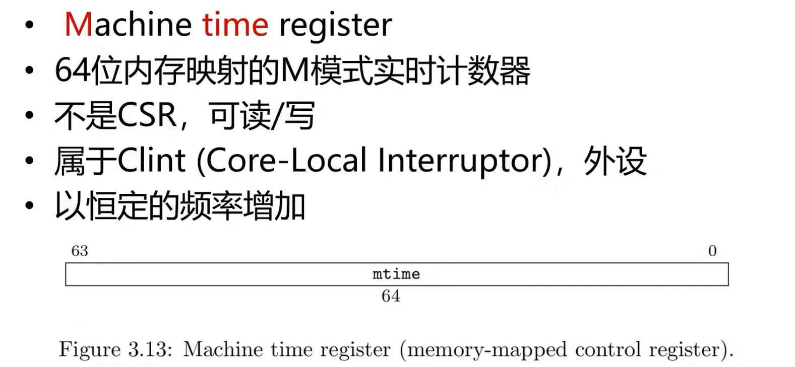

# 一生一芯计划 - riscv64处理器设计

网站链接： [一生一芯计划](https://ysyx.oscc.cc/docs/)

## 整体架构


代码结构：

```
    ├── defines.sv
    ├── top_wrapper.sv
    ├── top.sv
    ├── uni2axi.sv
    ├── core
    │   ├── core_top.sv
    │   ├── ifu
    │   │   └── ifu.sv
    │   ├── idu
    │   │   ├── idu_normal.sv
    │   │   ├── idu_system.sv
    │   │   └── idu.sv
    │   ├── exu
    │   │   ├── exu.sv
    │   │   ├── div
    │   │   │   └── div.sv
    │   │   └── mult
    │   │       ├── mult.sv
    │   │       ├── booth
    │   │       │   └── booth.sv
    │   │       └── wallace
    │   │           ├── wallace_tree_33.sv
    │   │           └── adder
    │   │               ├── csa_nbit.sv
    │   │               └── rca_nbit.sv
    │   ├── lsu
    │   │   └── lsu.sv
    │   ├── wbu
    │   │   ├── iru.sv
    │   │   └── wbu.sv
    │   ├── other
    │   │   ├── bru.sv
    │   │   └── clint.sv
    │   ├── regfile
    │   │   ├── regfile.sv
    │   │   └── bypass.sv
    │   └── csr_file
    │       └── csrfile.sv
    ├── cache
    │   ├── iCache_wrapper.sv
    │   ├── dCache_wrapper.sv
    │   └── cache
    │       ├── iCache.sv
    │       ├── dCache.sv
    │       └── cache_lib
    │           ├── iCache_tag_ary.sv
    │           ├── dCache_tag_ary.sv
    │           ├── S011HD1P_X32Y2D128_BW.sv
    │           └── data_ary.sv
    └── stdlib
        ├── stl_reg.sv
        ├── stl_rst.sv
        ├── stl_mux
        │   ├── stl_mux_default.sv
        │   ├── stl_mux_internal.sv
        │   └── stl_mux.sv
        └── interface
            ├── uni_if.sv
            └── axi4_if.sv
```

## 流水线问题

### 数据冒险旁路

1. 方式1：

   

2. 方式2：

   

我这里采用的是方式1，主要因为：WriteBack级后面的"pipeline reg"实际上是物理寄存器堆，那么使用方式2，那么还需要再访问一次regfile读reg~那样的话还需要再增加一个读端口。。属实没必要了。

- 为什么不采用和计组书上写的一样的前半个收起写reg，后半个周期读reg呢？

​	答：因为这样的话就需要用下降沿将一个时钟周期分开，那么ID阶段的时延就不够用了，无法提高到很高的频率！

具体执行方案：


其中红色的为主要bypass路a径，即通过后续的三级，来给本级进行bypass。

绿色为ld指令+alu指令，这种情况即使通过bypass也不一定可以解决，需要通过**冒泡**方式来进行处理。

### 数据冒险冒泡

有一种必须要冒泡的数据冒险：ld后紧跟alu，且alu的源是ld的目的，则必须要冒泡。

主体思路：对ID/EX的reg插入一个nop，同时让PC和IF/ID的寄存器保持一个周期不变。

具体手段：1. 给ID/EX一个nop信号，强制修改写入reg的内容；2. 给IF/ID一个stall信号停顿IF/ID，并通过反压握手让PC保持不变；


### 控制冒险

使用预测未命中的方案。

主体思路：只对IF/ID的reg插入一个nop，对其他的地方不做任何处理。

具体手段：给IF/ID一个nop信号，强制修改写入reg的内容；


## 分支跳转处理

分支跳转可以在ID/EX阶段进行计算。

在ID阶段进行分支跳转计算的话critical path是：

- ID/EX Reg的Q端(0.06) -> EXU阶段(77.40) -> bypass至ID阶段得到 rs1/rs2(0.06)  -> 分支跳转计算得到分支跳转的PC(0.46) -> 指令RAM的地址输入端口(尚未加SRAM 待定，应该不大)。

在EX阶段进行分支跳转计算的话critical path是：

- 路径1：ID/EX Reg的Q端(rs1/rs2) -> BRU的计算 -> 确定分支跳转的PC -> 指令RAM的地址输入端口
- 路径2：ID/EX Reg的Q端 -> EXU阶段 -> bypass至ID阶段的路径 -> rs1/rs2

>  感觉做芯片架构设计是一个tradeoff的思路，例如bypass就是一个非常明显的tradeoff思想：
>
>  - 完全不用bypss，组合逻辑延迟低，可以获得高主频，但需要频繁停顿；
>  - 采用非常激进的bypass，组合逻辑延迟较高，无法获得高主频，但不需要频繁停顿；
>  - 采用对时延影响较低的bypass方案，在不明显增加comb delay的情况下，尽可能的减少停顿次数；

所以根据tradeoff的思想，如果是在低频段：100MHz左右，那总时延在10ns左右，所以0.5ns的分支延迟其实影响不大，而冒泡次数影响很大，所以可以放到ID阶段来降低冒泡次数。但是如果到了1GHz，那延迟就是1ns级别，这时候分值计算带来的延迟就太太太大了，必须要放到EX阶段。

## 乘法器实现

### booth算法

首先需要明白：[X x Y]补 != [X]补 x [Y]补，而是。

所以64bit x 64bit其实需要完成64次128bit的加法！这岂不是GG了，那怎么化简？哎嘿，我们随便拿一个4bit的乘法器来看看，以5x(-7)为例子：


可以发现，对于乘数每一位来说，如果是0，则其实不用做乘、移位、加的一系列操作的！所以优化的思路也就很明显了：减少乘数中1的个数！

下面看一下这个化简过程（引入的y-1为0！）：


上面这个化简后的式子，第一行=号后是1位booth编码，第二行=号是2位booth编码，第一个关键的好处就是，把部分积化简成了统一的格式。

通过上面的化简过程，还可以看出来：基本的补码乘法器和1位booth编码乘法器仍然需要将64个部分和相加才能得到结果，延迟和面积非常大。

而引入的2位booth编码，其实就是通过变换将乘数的奇数位置都置零了！明显将部分和个数砍半了！！只需要进行32个部分和相加即可！

### 保留进位加法器/华莱士树

我们上面说到，通过使用2位boot编码的乘法器，可以简化为32个128bit部分和相加。而做一次128bit部分和相加就已经淦的一批了，更别说32个串行相加了，效率只能说是低的一批！

所以可以通过CSA这种结构的加法器，把3个数相加转换为2个数相加：[【HDL系列】进位保存加法器原理与设计 - 知乎 (zhihu.com)](https://zhuanlan.zhihu.com/p/102387648)

并且可以套娃！ 就是一层一层的套CSA，对于32个数，套到7层的时候，就可以算完！而且门延迟也不高！

## 除法器实现

移位除法，需要64个cycle完成，具体的看代码吧，不做过多解释。

## AXI总线

加了总线以后会有很多个问题，挑几个来说明一下吧：

1. 总线仲裁。注意不能在未完成传输的过程中，随意切换总线权限。

   ```verilog
   logic uniID;  // 1: dMemIf, 0: iMemIf. 
   
   wire dMemIfFree = dMemIf.valid & dMemIf.ready | !dMemIf.valid;
   wire iMemIfFree = iMemIf.valid & iMemIf.ready | !iMemIf.valid;
   
   always_ff @(posedge i_clk or negedge i_rst_n) begin
     if(!i_rst_n)begin
       uniID <= 1'b0;
     end else if(dMemIf.valid & iMemIfFree)begin
       uniID <= 1'b1;
     end else if(iMemIf.valid & dMemIfFree)begin
       uniID <= 1'b0;
     end
   end
   ```

2. 保持总线读取回的数值。我们知道总线在valid-ready握手以后，数据就不一定是持续的了。但是考虑这样一个场景：ifu阶段取值回来，由于EX阶段一直在计算，所以EX和ID都不能接受IF的数据。那这时候就必须要保持住IF读取到的值！所以要用一个寄存器来保持住~~

   ```verilog
   wire UniIf_Sh = iCacheIf_M.valid & iCacheIf_M.ready;
   
   logic [`INS_WIDTH-1:0] unif_rdata, unif_rdata_r;
   
   assign unif_rdata = iCacheIf_M.rdata[`INS_WIDTH-1:0];
   
   stl_reg #(
       .WIDTH      (`INS_WIDTH   ),
       .RESET_VAL  (`INS_WIDTH'b0)
   ) unidatareg (
       .i_clk      (i_clk        ),
       .i_rst_n    (i_rst_n      ),
       .i_wen      (UniIf_Sh     ),
       .i_din      (unif_rdata   ),
       .o_dout     (unif_rdata_r )
   );
   
   logic wait_post_ready;
   always_ff @(posedge i_clk or negedge i_rst_n) begin
     if(!i_rst_n)begin
       wait_post_ready <= 1'b0;
     end else if(i_flush | post_sh)begin
       wait_post_ready <= 1'b0;
     end else if(UniIf_Sh)begin
       wait_post_ready <= 1'b1;
     end
   end
   assign o_post_valid = UniIf_Sh | wait_post_ready; 
   assign o_ifu_ins    = UniIf_Sh ? unif_rdata : unif_rdata_r;
   ```

3. 总线的取消：注意发起一次传输请求以后，是不可以取消的，必须等待传输完成才可以！所以对于需要nop时是不可以直接需要其传输的，必须等到传输完成。在我的代码中，ID阶段进行分支跳转的计算，并得到nop信号，返回给IF-ID寄存器的输入。
   我的代码一个非常好的地方：PC-IF和IF-ID的两级寄存器，是使用一组握手信号进行控制的。所以当IF取指尚未得到结果时，PC-IF和IF-ID两级寄存器全部不变，（尽管此时pc的组合逻辑输入已经更新，但是依旧没有更新寄存器）。所以当握手完成时，由于EX级的组合逻辑输出的nop依旧存在，所以就把nop塞入了IF-ID寄存器，同时更新了PC-IF的新PC~~

4. 上面说到我的代码里在ID阶段进行了分支跳转计算，所以对于nop来说非常好操作，因为只需要通过握手信号来进行压住和反压即可。但是也带了一个问题：jalr x[n],x[n],imm 即jalr的rd和rs是同一个寄存器！由于分支是在ID阶段进行计算，然后传入EX阶段，在EX阶段计算rd。但是！但是！rd会通过bypass传给id阶段的分支计算！！如果ID阶段没有被立即采样，那么地址就会变错！！根本原因在于rs被更新了！！所以只需要在bru中加入一些逻辑保持住rs即可：

   ```verilog
   logic [`CPU_WIDTH-1:0] i_rs1_r, rs1;
   
   wire jalr_rs1id_eq_rdid = i_jalr & (i_exu_rdid == i_idu_rs1id);
   
   stl_reg #(
       .WIDTH    (`CPU_WIDTH   ),
       .RESET_VAL(`CPU_WIDTH'b0)
   ) jalr_save (
       .i_clk    (i_clk        ),
       .i_rst_n  (i_rst_n      ),
       .i_wen    (i_idu_valid & jalr_rs1id_eq_rdid ),
       .i_din    (i_rs1        ),
       .o_dout   (i_rs1_r      )
   );
   
   assign rs1 = (!i_idu_valid & jalr_rs1id_eq_rdid) ? i_rs1_r : i_rs1;
   ```

## csr/中断异常

### CSRRW/CSRRS/CSRRC


1. csrrw/csrrwi

   csrrw rd, csr, rs1. 或者 csrrwi rd, csr, uimm[4:0]

   主要逻辑：先读csr, csr -> rd. 再写：rs1/uimm -> csr. **注意读是有条件的，如果rdid==0，那就不读csr了。**

2. csrrs/csrrsi

   csrrs rd, csr, rs1. 或者 csrrsi rd, csr, uimm[4:0]

   主要逻辑：先读csr, csr -> rd. 再写csr, 将rs1/uimm为1的位置置为1,其余位置保持不变。**注意写是有条件的，如果rs1id==0，那就不写csr。**

3. csrrc/csrrci

   csrrc rd, csr, rs1. 或者 csrrci rd, csr, uimm[4:0]

   主要逻辑：先读csr, csr -> rd. 再写csr, 将rs1/uimm为1的位置置为0,其余位置保持不变。**注意写是有条件的，如果rs1id==0，就不写csr。**


一些衍生的伪指令：

| csrr rd, csr | csrrs rd, csr,x0 | 读csr寄存器 |
| ------------ | ---------------- | ----------- |
| csrw csr,rs  | csrrw x0,csr,rs  | 写csr寄存器 |

对于csrrw这六条指令来说：ID阶段进行decode+读取csrfile/regfile, EX阶段来计算要写入csr/rd的值，wb阶段写回csrfile/regfile。

### ecall/mret自陷异常

riscv提供ecall指令作为自陷指令，还提供了一些csr寄存器：

- mtvec(Machine trap-handler base address)：存放异常入口地址；在setup阶段进行初始化！

  

- mepc(Machine exception program counter)：保存触发异常的PC；

- mstatus(Machine status register)：保存处理器的状态；

  

- mcause(Machine trap cause)：存放触发异常的原因；

  

当触发异常，硬件的处理过程如下：

1. PC -> CSR[mepc]；
2. 异常号 -> CSR[mcause]；
3. CSR[mtvec] -> PC；

整个过程都是硬件完成！不需要软件操作！跳入异常入口地址后，由操作系统接管。

当执行完异常处理函数，riscv通过`mret`指令从异常处理过程中返回, 它将根据mepc寄存器恢复PC。

mret指令：


###  中断

参考：
[1] [CLINT和PLIC，risc-v中断_向芯的博客-CSDN博客](https://blog.csdn.net/qianniuwei321/article/details/123250492)
[2] [哪吒D1开发板RISC-V CLINT编程实践 - 知乎 (zhihu.com)](https://zhuanlan.zhihu.com/p/506829650)

异常中断可以分为异常+中断：

- 异常：使用ecall+mret等进行处理的自陷操作，用于触发系统调用，一般是通过指令产生，返回时需要通过软件将mep+4。
- 中断：
  - 内部中断：使用Core Local Interruptor (CLINT)控制，riscv spec只规定了两种：
    - 软件中断software
    - 中断timer
  - 外部中断：使用Platform-Level Interrupt Controller (PLIC)控制，有多种~


那clint和plic有什么区别吗？从图里就能看出来，CLINT和PLIC最大的区别在于，CLINT没有仲裁，包括software和Timer,一有中断马上响应（software中断怎么产生的：用软件直接写一个寄存器当作软件中断）。而PLIC需要一个仲裁决定谁先中断，存在个优先级的问题。

典型的中断流程：

1. 硬件：外设发出中断信号。
2. PLIC或者CLINT响应中断，RISC-V核心把当前的CSR + Reg压入栈。
3. 把当前的pc值存进mepc，跳转到中断处理程序的地址（mtevc），关闭其他中断响应使能（RISC-V不支持嵌套，所以一个中断要屏蔽其他中断）。
4. 软件保存通用的寄存器。
5. 处理中断（过程中会清掉外设的中断）。
6. 软件恢复通用的寄存器+恢复CSR。
7. 然后跳转PC跳回原来位置退出异常。

#### 中断相关的寄存器

1. MIP(Machine interrupt pending reg), 可读，有条件可写。

   

2. MIE(Machine interrupt eanble reg)，中断使能开关，即可读也可写。

   

   #### Clint实现

   1. mtime寄存器：

      

   2. mtimecmp：

      

#### 计数器中断

触发计数器中断的三个条件：

1. mstatus寄存器的mie位为1
2. mie寄存器的的mtie位为1

3. mtime ≥ mtimecmp

CPU捕获到计数器中断后的处理：

1. mepc保存wbu的pc，注意不要commit掉wbu的这条指令！
2. mcause保存相应的值，计数器应该是0x80 00 00 00 00 00 00 07。
3. mstatus, mpie设置为mie的值，mie设置为0。
4. 跳转到mtvec的地址。

### 实现过程中需要注意的问题

对于ecall/ebreak/mret，以及定时器中断/外部中断等指令来说，全部在最后一级进行处理，因为只有提交时进行处理才能触发精确异常！那么对于总线就带来了一些需要处理的问题：

需要flush掉前面四条指令。但是在flush时还需要等待总线完成！

接入第三期环境，编写步骤：

1. 实现csr寄存器。done。
2. 实现csrrw/rs/rc六条指令的ID、EX、WB。done。
3. 实现iru模块，位于wbu阶段，用于实现ecall/mret等异常的响应，实现timer的中断等。done.
4. 注意上面的iru模块出现excp/intr时，需要flush掉前面四级流水线中的数据，并且需要用组合逻辑提前让lsu关闭，不要送上总线！等待if的取指结束时提交wbu的指令，并flush掉整个流水线。（需要增加div的flush信号）done.
5. 需要在id阶段实现csr的bypss, waiting to do.

6. 注意，在处理excp时直接commit即可，但是处理intr时，必须要在wbu的valid为高时才能产生intr信号，并且不可以commit当前的指令！！（因为只有这样，才没有完成这条指令，恢复时重新执行这条指令。）

### 一些技术细节

首先，wbu在这里也不是一拍就能完成，需要分情况讨论：

- 没有intr和excp时：一拍完成，直接提交即可。
- 存在excp时：控制wbu_ready，等待总线的传输完成，才可以commit。
- 存在intr时：控制wbu_ready，等待总线的传输完成，且wbu_valid&wbu_ready有了才可以传递下一级并更改PC。但是不commit。

## Cache

### Cache的三种清空概念

首先介绍对cache的三种清空概念：

- clean: 检查对应内存cache line 的dirty bit。如果dirty bit为1，将cache line的内容写回下一级存储，并将dirty bit置为0.
- invalid: 检查对应内存cache line 的valid bit.如果valid bit 为1，置为0.
- flush: 每条cache line 先clean，再invalid.

### iCache方案

- index = 7bit，offset = 4 bit， tag = 21bit
- Data Array：同步SRAM实现，Size = 4KB, CacheLine = 128bit/16byte, Way = 2,  Set = 128；
- Tag   Array： 寄存器实现，Way = 2, Set = 128, 内容为1bit valid, 21bit tag
- iCache支持invalid，仅1个cycle可完成，具体实现原理为对Tag Array的所有底层寄存器做写入操作；【用于实现fence.i】
- 状态机共三个状态：IDLE, BUS, HIT
  - IDLE: 根据输入的index和tag，从Tag   Array读取匹对，如果匹配，那么开启Tag   Array读使能；
  - BUS:  如果miss，那么进入到这个状态，向总线发出读DRAM请求，并替换，然后跳回IDEL；
  - HIT:   如果hit，那么进入到这个状态，返回Tag   Array的读数据，并给CacheIf一个ready；

### dCache方案

- index = 7bit，offset = 4 bit， tag = 21bit
- Data Array：同步SRAM实现，Size = 4KB, CacheLine = 128bit/16byte, Way = 2,  Set = 128；
- Tag   Array： 寄存器实现，Way = 2, Set = 128, 内容为1bit dirty, 1bit valid, 21bit tag
- dCache支持clean，需要(256~256*DRAM延迟)不等个cycle完成，具体实现原理是使用计数器cnt遍历全部cacheline，将dirty&valid的块写回DRAM；【用于实现fence.i】
- 状态机共六个状态：IDLE,  WBUS,  RBUS,  HIT,  CLEAN_CUNT,  CLEAN_WBUS
  - IDLE: 根据输入的index和tag，从Tag   Array读取匹对，如果匹配，那么开启Tag   Array读使能；
  - WBUS:如果miss，且dirty&valid，那么进入到这个状态，向总线发请求写回牺牲快，然后跳入RBUS；
  - RBUS: 如果miss，且!dirty，那么直接跳入这个状态，或从WBUS跳入这个状态，向总线发请求读新块；
  - HIT:   如果hit，那么进入到这个状态，返回Tag   Array的读数据，并给CacheIf一个ready；
  - CLEAN_CUNT: 用于clean dCache，在这个状态下每拍对cnt++，当cnt==255，跳回IDLE, clean完毕；
  - CLEAN_WBUS: 如果CLEAN_CUNT下，cnt对应的line为dirty则进入到这个状态，写回脏块；

## 接入SoC

### 外设支持

```c
      reserve             0x0000_0000~0x01ff_ffff
       CLINT              0x0200_0000~0x0200_ffff
      reserve             0x0201_0000~0x0fff_ffff
     UART16550            0x1000_0000~0x1000_0fff
    SPI controller        0x1000_1000~0x1000_1fff
        SPI	              0x1000_1000~0x1000_1fff
        VGA	              0x1000_2000~0x1000_2fff
        PS2	              0x1000_3000~0x1000_3fff
      Ethernet	          0x1000_4000~0x1000_4fff
      Reserve	          0x1000_5000~0x2fff_ffff
  SPI-flash XIP mode      0x3000_0000~0x3fff_ffff
    ChipLink MMIO         0x4000_0000~0x7fff_ffff
       MEM	              0x8000_0000~0xfbff_ffff
      SDRAM	              0xfc00_0000~0xffff_ffff
```

使用了iCache_wrapper和dCache_wrapper来实现过cache和不过cache。对于memory，则是cachable的；对于非memory的其他外设，均为uncachable的；

对于uncachable的外设，则通过Cache_wrapper直接旁路至MemIf总线，并转换为AXI总线，不再经过Cache；


### fence.i

fence.i的目的，主要是实现iCache和dCache的缓存一致性，参考：[iCache和dCache一致性 - 知乎 (zhihu.com)](https://zhuanlan.zhihu.com/p/112704770)


如上图所示，程序的第一条指令是从flash取出，并将相关程序的指令和数据从flash 0x30开头的地址中load出来，然后store到内存中，再将PC跳转至内存0x80开头的地址中。这个过程就会存在两个问题：

- store到DRAM的ins/data有可能还没有到DRAM中，仅仅是在dCache中为dirty cacheline；
- 修改了指令后，iCache并不知道相关指令已被修改，所以iCache中的指令为旧指令，并不正确；

所以riscv提供了fence.i指令来完成这件事，当从flash load程序完毕以后，在执行PC跳转至内存之前，插入一个fence.i，fence.i的功能是：

1. clean掉dCache中全部的dirty cacheline，即将脏块全部写回DRAM；
2. invalid掉iCache中的全部cacheline，即将iCache中的数据全部置为无效；

此后，当PC指向内存中时，取指时会首先发生iCache miss，然后会自动去DRAM读取新的Cacheline，此时的数据就是正确的啦！

## 尚未支持

1. 未完全处理非对齐传输（处理了，但没完全处理，由软件保证外设禁止跨越64bit边界，内存禁止跨越128bit边界即可）
2. 未支持csr bypass，不知道会不会有其他影响，目前暂时rt-thread没受影响


